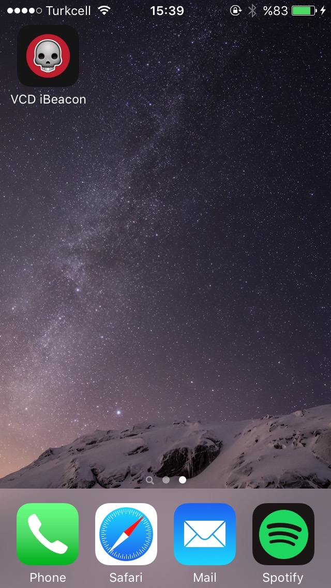
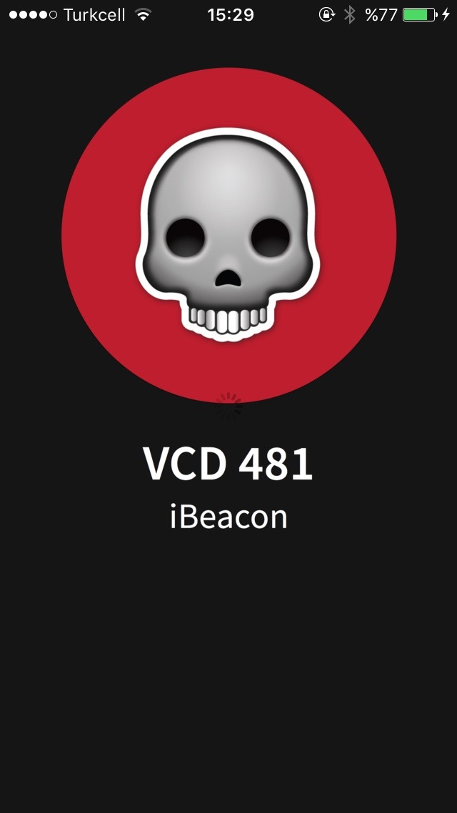
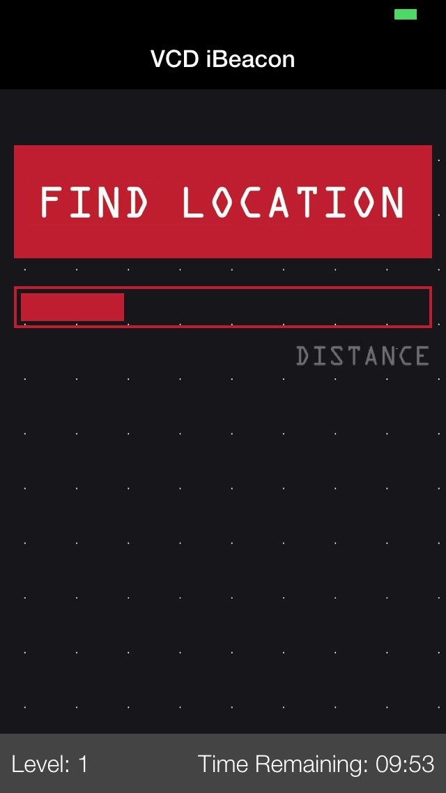
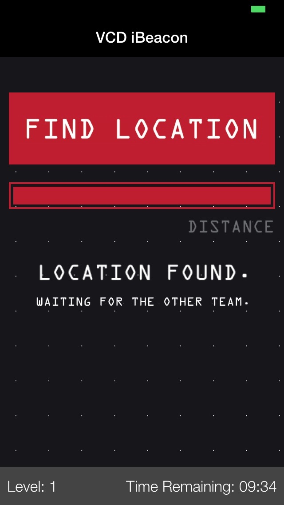
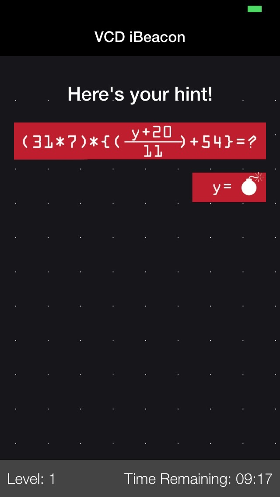
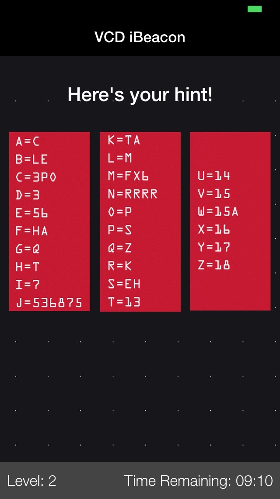
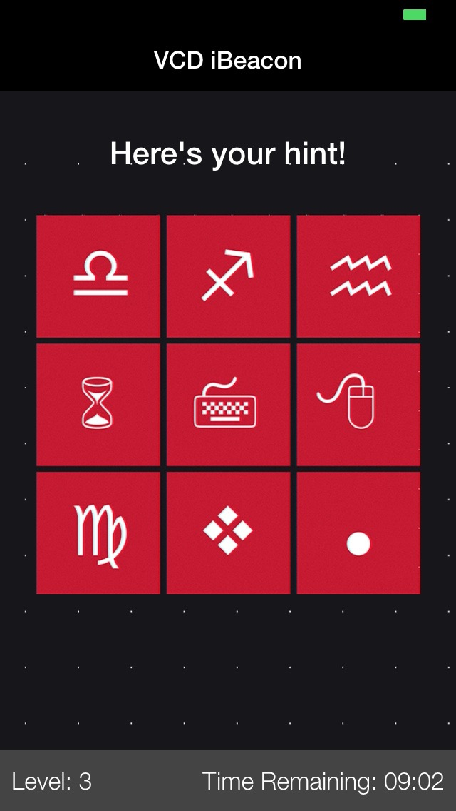
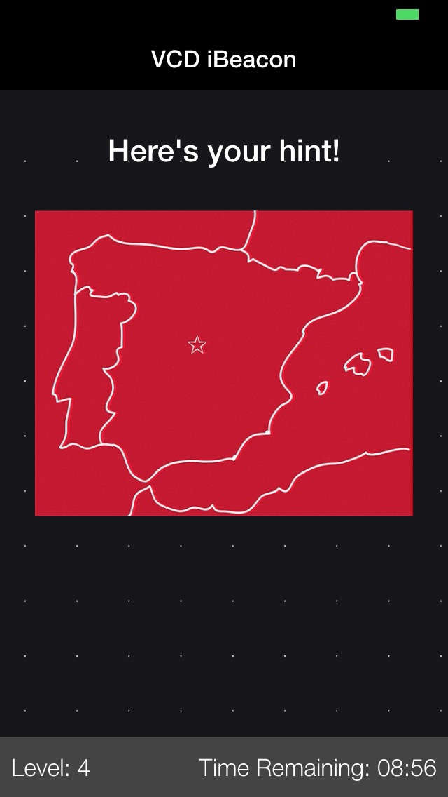
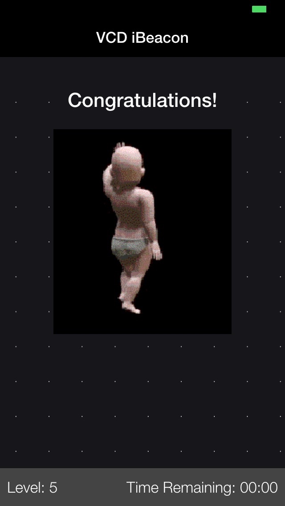
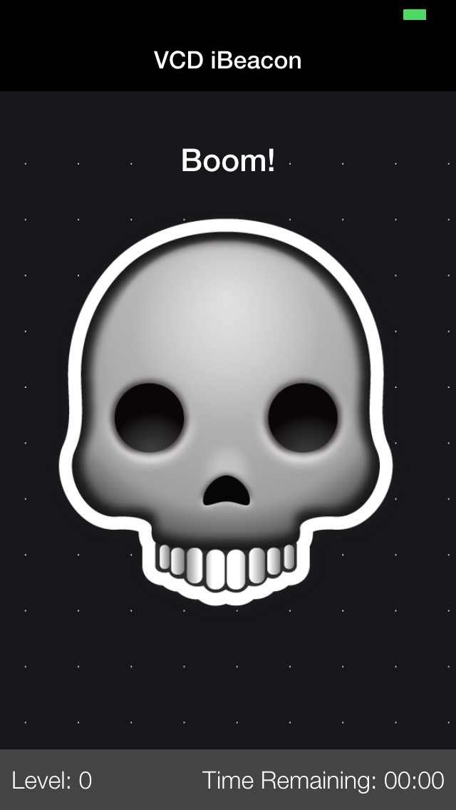

# VCD 481 - iBeacon Application

An iOS application made with [Ionic Mobile App Framework](http://ionicframework.com/) by using [Cordova iBeacon Plugin](https://github.com/petermetz/cordova-plugin-ibeacon). It's built for the hint part of puzzle game we are dealing in [VCD 481 (Physical Interaction Design)](http://ects.bilgi.edu.tr/Course/Detail?catalog_courseId=80631) Course.

---

**How it works?**

There are 4 levels of the puzzle and 2 smartphones, one is "the bomb", and the other one is the "hinter".

Each level takes place near a specific iBeacon. So, in order to start solving the puzzle you need to get closer to the related iBeacon. This process is controlled by checking the minor values of iBeacons.

Once the smartphones find the place, hinter will show the hint and "the bomb" will show the puzzle.

The puzzleLevel and statuses (isBeaconOneFound & isBeaconTwoFound) are being stored in a database, and [served with an API](https://github.com/zebrasinpyjamas/puzzleStatusAPI). Unique minor values were assigned to four beacons, level system was (2-4-3-1) for hinter and (1-2-4-3) for the bomb.

---

**Screenshots**

